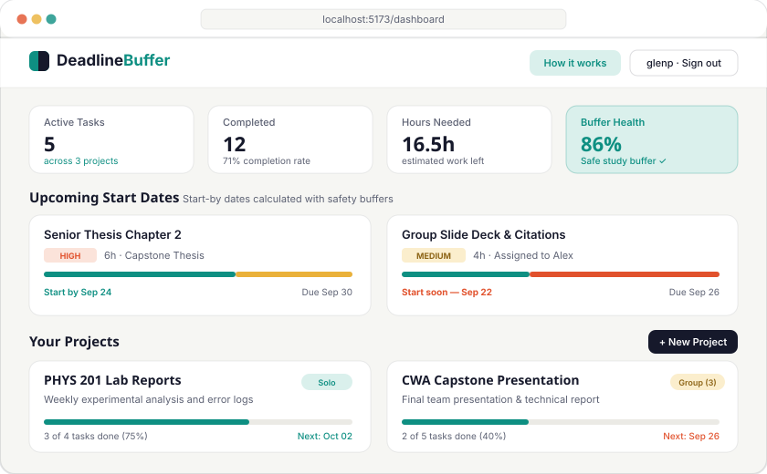
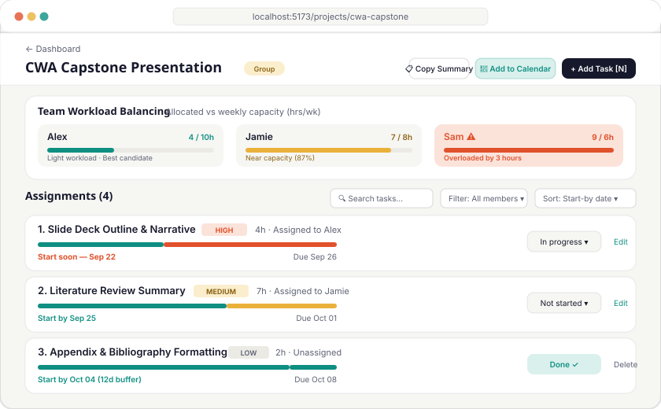

# Deadline Buffer + Group Work Splitter

A responsive web application that turns stressful assignment deadlines into calm, realistic start-by dates and balances group workloads by team member availability.

---

## 1. Overview

Deadline Buffer is a student-focused productivity web app designed to eliminate last-minute cramming and unfair group project splits. Instead of counting down to a final due date, the app calculates a realistic **Start-By Date** by estimating required focused study hours, applying a priority-scaled safety buffer, and rendering a to-scale visual buffer bar for every assignment. For group projects, it tracks each teammate's declared weekly availability (`hours_per_week`) and auto-suggests assignments to the member who currently has the lightest workload.

---

## 2. Setup and installation

Follow these steps in order to set up and run the project from scratch on your local machine.

### Prerequisites & Versions
- **Node.js**: v18.0.0 or higher (developed and tested on Node v20/v24)
- **npm**: v9.0.0 or higher
- **Git**: Installed and available in your terminal
- **Supabase Account**: A free account at [supabase.com](https://supabase.com) (provides PostgreSQL database and authentication)

### Step 1: Clone the repository
```bash
git clone https://github.com/qwertyuipaas/deadline-buffer.git
cd deadline-buffer
```

### Step 2: Install dependencies
```bash
npm install
```

### Step 3: Configure environment variables
Create a `.env` file in the project root by copying the provided example template:

```bash
cp .env.example .env
```

Open `.env` and fill in your Supabase project credentials (available in your **Supabase Dashboard → Project Settings → API**):

```env
# Supabase API Configuration
VITE_SUPABASE_URL=https://your-project-id.supabase.co
VITE_SUPABASE_ANON_KEY=your-anon-public-key
```

> **Security Note:** Never commit `.env` containing real keys to version control. The `.env` file is already listed in `.gitignore`.

### Step 4: Set up the database schema
1. Log in to your project at [supabase.com](https://supabase.com).
2. Navigate to **SQL Editor** in the left sidebar and click **New query**.
3. Open the [`supabase/schema.sql`](supabase/schema.sql) file from this repository, copy all contents, paste them into the SQL Editor, and click **Run**.
4. This script creates:
   - `public.projects`: Stores solo and group projects.
   - `public.project_members`: Stores teammates and their weekly hour capacities (`hours_per_week`).
   - `public.tasks`: Stores assignments, deadlines, estimated hours, priorities, and calculated start-by dates.
   - `tasks_set_updated_at`: A trigger function to keep modification timestamps in sync.
   - **Row Level Security (RLS)** policies ensuring users can only read and modify their own projects and tasks.

*(Optional development tip)*: In Supabase under **Authentication → Providers → Email**, you can toggle off "Confirm email" to log in immediately during testing without waiting for confirmation emails.

---

## 3. How to run it

Start the local Vite development server:

```bash
npm run dev
```

### Expected Output & Address
Your terminal will display the local development URL:

```
  VITE v8.2.0  ready in 280 ms

  ➜  Local:   http://localhost:5173/
  ➜  Network: use --host to expose
```

Open your browser and navigate to **`http://localhost:5173/`**. 

**What you should see:** The public landing page showcasing the interactive Deadline Buffer product thesis, live buffer bar demonstrations, a rotating headline of course project types, feature breakdowns, and buttons to **Sign Up** or **Sign In**.

---

## 4. Features and usage

### Primary User Flow
1. **Account Creation & Login:** Register with an email, password, and username. Live validation confirms username format and availability.
2. **Dashboard Overview:** View active semester metrics—total active assignments, completed tasks, estimated hours remaining, and your real-time **Buffer Health Score** (0–100%).
3. **Create a Project:** Click **+ New Project** (or pick an academic template like *Senior Thesis* or *Group Presentation*). Choose between:
   - **Solo:** Single-user project with focused task pacing.
   - **Group:** Add teammates along with their weekly available hours (e.g. Alex: 10 hrs/wk, Jamie: 8 hrs/wk).
4. **Add Tasks with Instant Buffer Calculations:**
   - On any project page, click **+ Add task** or press the <kbd>N</kbd> keyboard shortcut to open the slide-in drawer.
   - Enter task name, deadline, estimated hours, and priority (Low, Medium, High).
   - As you type, the form shows a live preview of your recommended **Start-By Date**.
5. **The Buffer Bar:**
   - Every task displays a to-scale, color-coded visual indicator. Teal represents the safe buffer window (time before work must start), amber/coral represents the active work window, and red indicates overdue start dates.
6. **Smart Group Workload Balancing:**
   - For group projects, the assignment dropdown calculates each member's non-completed task hours and highlights the teammate with the most remaining capacity.
   - Teammate cards display visual meters flagging when someone is approaching capacity or overloaded (`⚠`).
7. **Export & Sharing Hub:**
   - **Add to Calendar:** Downloads a standardized `.ics` file with all start-by dates and deadlines, compatible with Google Calendar, Apple Calendar, and Outlook.
   - **Copy Summary:** Generates an emoji-formatted Markdown summary to paste directly into Discord, WhatsApp, or Slack study groups.

---

## 5. Project structure

```
deadline-buffer/
├── public/                     # Static assets and course milestone documentation
│   ├── design-system/          # M6A3 design tokens and component specification
│   ├── journal/                # M7A1 reflection journal
│   ├── wireframes/             # M6A2 early wireframe sketches
│   ├── favicon.svg             # Application favicon
│   └── _redirects              # SPA routing rewrite rule for deployment
├── src/
│   ├── components/             # Reusable UI components
│   │   ├── BufferBar.jsx       # Signature to-scale timeline visual
│   │   ├── ConfirmDialog.jsx   # Styled modal confirm dialog
│   │   ├── DatePicker.jsx      # Accessible calendar picker with year/month jump
│   │   ├── MemberWorkloadBar.jsx# Teammate weekly capacity progress bar
│   │   ├── OnboardingChecklist.jsx# 3-step getting started card
│   │   ├── ProductTour.jsx     # Interactive spotlight guided tour
│   │   ├── ProtectedRoute.jsx  # Route guard for authenticated paths
│   │   └── TaskDrawer.jsx      # Slide-in task creation/editing side panel
│   ├── context/
│   │   ├── AuthContext.jsx     # Supabase session and user management
│   │   └── ToastContext.jsx    # System notifications
│   ├── hooks/                  # Custom React state and data hooks
│   │   ├── useMemberForm.js    # Member addition logic
│   │   ├── useProjectData.js   # Loads and reloads project, members, tasks
│   │   ├── useTaskEdit.js      # Task inline modification handler
│   │   └── useTaskForm.js      # Task creation validation and submission
│   ├── lib/                    # Pure business logic and utilities
│   │   ├── dateCalc.js         # Buffer algorithm, local timezone ISO helpers
│   │   ├── exportUtils.js      # .ics iCalendar generator and chat summaries
│   │   ├── groupUtils.js       # Member workload calculation and auto-assign logic
│   │   ├── profileService.js   # Username validation and availability checks
│   │   └── supabaseClient.js   # Supabase client instantiation
│   ├── pages/                  # Top-level view routes
│   │   ├── Dashboard.jsx       # Main overview with metrics, timeline, scratchpad
│   │   ├── Landing.jsx         # Marketing landing page with interactive demo
│   │   ├── Login.jsx           # User sign-in
│   │   ├── NewProject.jsx      # Project creation wizard
│   │   ├── ProjectView.jsx     # Project workspace, tasks, workload balancing
│   │   └── SignUp.jsx          # User registration and style onboarding
│   ├── App.jsx                 # Route definitions and context providers
│   ├── index.css               # Tailwind CSS v4 @theme design tokens
│   └── main.jsx                # Application entrypoint
├── docs/
│   └── screenshots/            # UI screenshots and visual mockups
├── supabase/
│   └── schema.sql              # PostgreSQL schema, triggers, and RLS policies
├── .env.example                # Template environment variables
├── package.json                # Project dependencies and npm scripts
├── REPORT.md                   # Weekly increment progress report
└── AI-USAGE.md                 # AI usage, attribution log, and badge document
```

---

## 6. Screenshots

### Dashboard Overview
*Real-time buffer health score, semester metrics, upcoming start dates, and project cards:*



---

### Project Workspace & Team Workload Balancer
*Visual teammate capacity meters, task status controls, start-by dates, and the signature Buffer Bar:*



---

## 7. Known issues and next steps

While the core buffer engine and workload balancer are fully functional, the following limitations are known and slated for future increments:

### Known Issues
- **Multi-user authentication for group teammates:** Currently, Supabase Row Level Security (RLS) policies are owner-centric (`projects.owner_id = auth.uid()`). Teammates can be added by name with weekly hour capacities, but they cannot yet log in with separate accounts to view their assigned tasks independently without owner credentials.
- **`profiles` table migration:** Username checks and preferences in `profileService.js` are currently supported via client-side fallbacks if the `profiles` table is not yet migrated to the remote Supabase database.
- **Weekend exclusion:** The current buffer calculation assumes a standard continuous day model ($2\text{ focused hours/day}$). It does not yet account for customizable student schedules (e.g. students who only study on weekdays or weekends).

### Next Steps
1. **Collaborative Group RLS:** Write non-recursive PostgreSQL policies enabling invited members with registered Supabase accounts to view and update tasks assigned to them.
2. **Push / Email Notifications:** Send browser alerts or email reminders when an assignment transitions from "safe buffer" into "start today".
3. **Interactive Gantt / Calendar View:** Build a visual calendar timeline showing overlapping task buffers across all enrolled courses.

---

## AI usage

This project was built with the assistance of AI tools (Claude and ChatGPT) used for pair programming, algorithm brainstorming, and debugging. Full documentation of tools used, specific contributions, bugs caught, and human verification workflows is detailed in [`AI-USAGE.md`](AI-USAGE.md).
